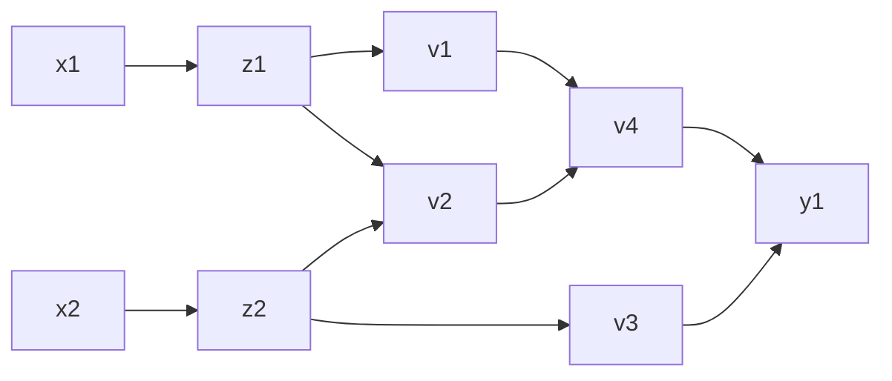
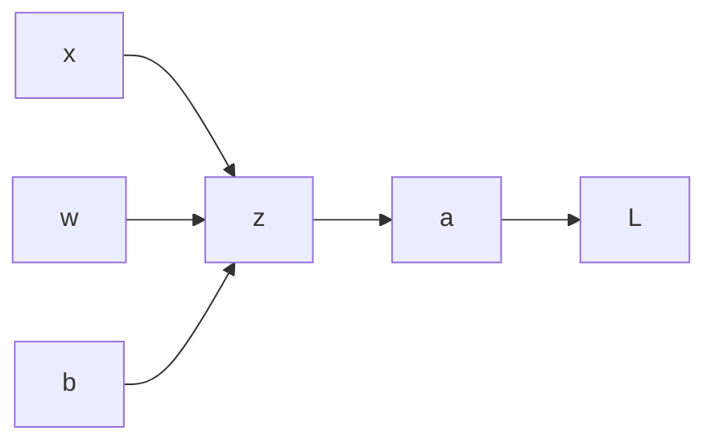

## Logistic Regression as a Neural Network

#### Binary Classification

- Input: $x \in \mathbb{R}^{n_x}$
- Output: $y \in {0,1}$
- Goal: learn a classifier that can input an image represented by this feature vector $x$. And predict whether the corresponding label y is $1$ or $0$

###### Notation

$$
\begin{align*}
&m \text{ training examples} : \left\{(x^{(1)},y^{(1)}), \dots , (x^{(m)},y^{(m)})\right\} \\ \\
&X = \begin{pmatrix} x^{(1)} | \dots x^{(n)} \end{pmatrix} \quad \quad X \in \mathbb{R}^{n \times m} \\
&Y = \begin{pmatrix} y^{(1)} | \dots y^{(n)} \end{pmatrix} \quad \quad Y \in \mathbb{R}^{1 \times m}
\end{align*}
$$

#### Logistic Regression

- Input: $x \in \mathbb{R}^n$
- Want: $\hat{y} = P(y=1 | x)$ 
- Parameters: $w \in \mathbb{R}^n$, $b \in \mathbb{R}$
- Output: $\hat{y} = \sigma(w^\top x + b)$ with  $\sigma(z) = \frac{1}{1 + e^{-z}}$

###### Loss (error) function

$$
L(\hat{y},y) = -\left(y \log{\hat{y}} + (1-y)\log(1-\hat{y})\right)
$$

###### Cost function

$$
\begin{align}
J(w,b) &= \frac{1}{m} \sum_i L(\hat{y}^{(i)}, y^{(i)}) 
\end{align}
$$

> The loss function is applied to a single training example and the cost function is the cost of your parameters (you use the whole dataset) and so to train models we use the cost function.

#### Gradient Descent

We want to minimize the cost function, the gradient descent method uses the derivative to give steps in the stepest descent direction in order to minimize the function. The sequence obtained is given by:
$$
w^{(i)}  := w^{(i-1)} - \alpha \frac{\partial J(w)}{\partial w}
$$
Where $\alpha$ is named the *learning rate*. 

#### Computation graph

Consider the function $f: \mathbb{R}^2: \to \mathbb{R}$ where $f(x)=\log(x_1)+x_1x_2 - \sin(x_2)$. 

> You can compute the derivatives with the computation graph using the chain rule smartly

#### Logistic Regression Gradient Descent

Remember:
$$
\begin{align*}
\hat{y} &= \sigma(w^\top x + b) \\
&:= \sigma(z) \\
&:= a \\

L(\hat{y},y) &= -\left(y \log{\hat{y}} + (1-y)\log(1-\hat{y})\right) \\
&:= L
\end{align*}
$$
Then the computation graph is given by:

So the derivatives of the loss function are:
$$
\begin{align*}
\frac{\partial L}{\partial a} &= -\frac{y}{a} + \frac{1-y}{1-a} \\ \\

\frac{\partial L}{\partial z} &= \frac{\partial L}{\partial a} \frac{\partial a}{\partial z}\\ &= \left(\frac{y}{a} + \frac{1-y}{1-a}\right) (a (1-a)) \\
&= a - y \\ \\

\frac{\partial L}{\partial w_i} &= \frac{\partial L}{\partial z}\frac{\partial z}{\partial w_i} \\
&= (a-y)x_i \\ \\ 

\frac{\partial L}{\partial b} &= \frac{\partial L}{\partial z}\frac{\partial z}{\partial b} \\
&= (a-y) \\ \\ 

\end{align*}
$$

#### Logistic Regression Gradient Descent (m examples)

Remember that the cost function is given by
$$
\begin{align}
J(w,b) &= \frac{1}{m} \sum_i L(\hat{y}^{(i)}, y^{(i)}) 
\end{align}
$$
Then, we can calculate the derivatives as follows
$$
\begin{align*}
\frac{\partial J}{\partial w_i}  &= \frac{1}{m} \sum_i \frac{\partial L(\hat{y}^{(i)}, y^{(i)})}{\partial w_i} \\ 
&= \frac{1}{m} \sum_i (a-y)x_i \\\\
\frac{\partial J}{\partial b}  &= \frac{1}{m} \sum_i \frac{\partial L(\hat{y}^{(i)}, y^{(i)})}{\partial b} \\ 
&= \frac{1}{m} \sum_i (a-y)
\end{align*}
$$

#### Algorithm

$\overline{\hspace{ 10in}} \\ \textbf{Logistic Regression Gradient Descent} \\ \overline{\hspace{ 10in}}$

**Input:** 	$X = \begin{pmatrix} x^{(1)} | \dots x^{(n)} \end{pmatrix} \quad \quad X \in \mathbb{R}^{n \times m} $ 	$Y = \begin{pmatrix} y^{(1)} | \dots y^{(n)} \end{pmatrix} \quad \quad Y \in \mathbb{R}^{1 \times m}$ 	$n_{iter}$ 

**Output**: 	$w \in \R^n $ 	$b \in \R$

Initialize $w$ and $b$ **for** $i \in \{1,...n_{iter}\}$  		$Z=w^\top X + b$  		$A=\sigma(Z)$  		$dZ = A - Y$  		$dW = \frac{1}{m} X dZ^\top$ 		$db = \frac{1}{m} sum(dz)$ 		

​		$w \leftarrow w - \alpha dW$ 		$b \leftarrow b - \alpha db$ $\overline{\hspace{ 10in}} $

